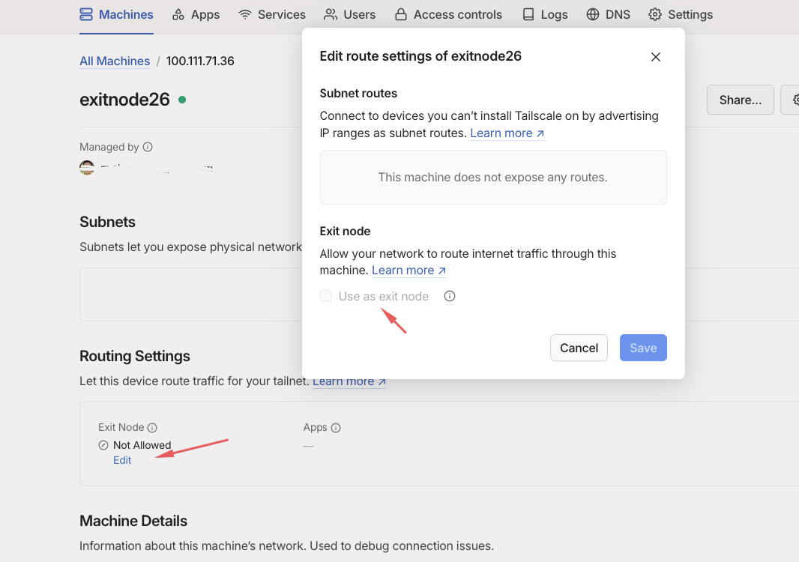
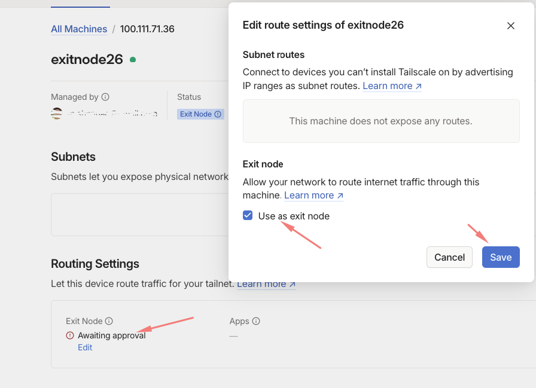
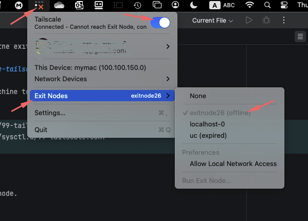

# Enable tailscale extinode on linux - Ubuntu

In this document I will show you how to enable tailscale exitnode on your linux machine to use it as an exit node on your tailscale network.

- You must  have a [tailscale account](https://tailscale.com/).
- You have tailscale client installed on your machine.
- Uou have a machine (linux) that you want to use as an exit node.

## Install tailscale

Install tailscale on your linux machine by running the following command:

```bash
curl -fsSL https://tailscale.com/install.sh | sh
```

then run the following command to authenticate your machine:

```bash

tailscale up
```

You will be prompted to authenticate your machine by visiting a link in your browser.

visit the link and authenticate your machine.

## Enable exit node

To enable exit node on your machine you need to configure the exit node on the tailscale admin console. 



But before that you have to configure the route on your machine to allow the exit node to work.

```bash
echo 'net.ipv4.ip_forward = 1' | sudo tee -a /etc/sysctl.d/99-tailscale.conf
echo 'net.ipv6.conf.all.forwarding = 1' | sudo tee -a /etc/sysctl.d/99-tailscale.conf
sudo sysctl -p /etc/sysctl.d/99-tailscale.conf
firewall-cmd --permanent --add-masquerade
```

Then restart the tailscale service and advertise the exit node.

```bash
sudo tailscale down
sudo tailscale up --advertise-exit-node
sudo tailscale up
```

Then Goto tailscale admin portal and enable the exit node.




Then from your tailscale client you can now select the exit node.



For more help please contact us @ [Extendy](https://extendy.net)


## References
- https://tailscale.com/kb/1103/exit-nodes#configure-an-exit-node
- https://tailscale.com/s/ip-forwarding